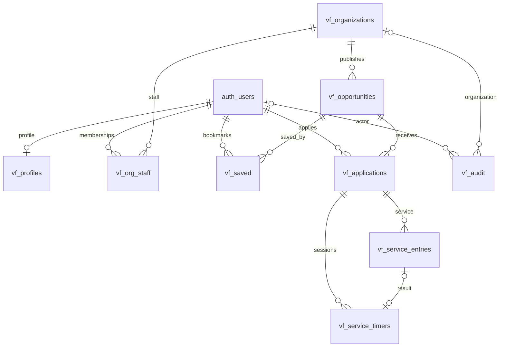

# Volunteer-service schema

The executable source is [the shared baseline migration](migrations/202609280001_voluforge_native.sql). All application tables live in `public`; authorization helpers live in the unexposed `vf_private` schema. Supabase owns `auth.users` and Storage.

## Entity relationship diagram

The diagram shows primary ownership relationships. Additional user references include application deciders, service reviewers, and service/timer owners. `proof_path` references an object by validated path rather than a SQL foreign key, because Supabase Storage manages object lifecycle.

## Table dictionary

| Table | Primary key | Data and constraints |
| --- | --- | --- |
| `vf_profiles` | `id` → `auth.users.id` | Name, school, bio, skills, causes, goal hours, deletion freeze, creation time. Created by Auth trigger; goal 1–10,000 hours. |
| `vf_organizations` | `id` UUID | Name, description, HTTPS website, verified flag, creation time. Only trusted operators verify. |
| `vf_org_staff` | `(org_id, user_id)` | Organization membership, `owner`/`reviewer` role, active flag. Membership and verified organization are both required for staff operations. Both roles currently have the same workflow permissions. |
| `vf_opportunities` | `id` UUID | Organization, title, description, category, location/remote, HTTPS image, start/end, capacity, minimum age, skills, proof requirement, publication status. End follows start; capacity 1–10,000. |
| `vf_saved` | `(user_id, opportunity_id)` | Private bookmarks with creation timestamp. One bookmark per user/opportunity. |
| `vf_applications` | `id` UUID | Student, opportunity, message, availability, status, current decision note/actor/time. Unique student/opportunity pair prevents repeat applications, including after withdrawal. |
| `vf_service_entries` | `id` UUID | Student, application, UTC service date, integer minutes, work notes, proof path, manual/timer source, optional interval, status, current reviewer/note/time. Composite FK `(application_id, student_id)` prevents assigning service to another student's application. |
| `vf_service_timers` | `id` UUID | Student, application, server start/stop timestamps, optional unique resulting entry. Composite application/student FK; partial unique index permits one active timer per student. |
| `vf_audit` | `id` bigint identity | Nullable actor/organization, entity UUID, action, status-only JSON metadata, creation timestamp. Clients cannot insert/update/delete audit events. Entity UUID is intentionally not a polymorphic FK. |

Every application table has RLS enabled. UUID entity keys default to `gen_random_uuid()` except identities inherited from Auth. Creation timestamps default to the server's `now()`.

## Workflow invariants

| Record | States and transitions |
| --- | --- |
| Opportunity | `draft`, `published`, `closed`; verified staff save through `vf_upsert_opportunity`. Organization identity cannot change, and capacity cannot drop below accepted applications. |
| Application | `pending` → `accepted` or `declined`; own pending/accepted application → `withdrawn` only without service records or an active timer. |
| Service entry | `pending` → `approved`, `changes_requested`, or `rejected`; submitter can resubmit `changes_requested` → `pending`. Approved/rejected entries cannot be rewritten via the public API. |
| Timer | Active → stopped with one submitted entry, or canceled. Repeated stop returns the same entry. |

Service requires an accepted application. Each entry is 1–720 minutes; non-rejected entries total at most 1,440 minutes per student/day. Manual inputs encode duration, not intervals, so overlapping manual sessions cannot be inferred. Timers use server timestamps. Reviewers cannot review their own work; change requests and rejection require notes. Only approved entries are returned by `vf_verified_record`.

Application acceptance locks the opportunity to enforce capacity. Service submission locks the student's profile to enforce the daily cap. These locking paths need concurrent-connection testing on Supabase as well as the isolated regression suite.

## Access model

| Caller | Permitted access |
| --- | --- |
| Anonymous | No application tables or workflow RPCs. Public/demo exploration uses separate data. |
| Active user | Own editable profile fields, bookmarks, applications, entries and timers; verified organizations and published/closed listings; own audit actions. Workflow changes use RPCs. |
| Active verified organization staff | Own organization's applications and service entries, applicant profiles, associated proof, organization audit events; publish, decide, and review via RPCs. |
| Trusted operator / service role | Provision organizations/memberships and verify organizations. The account-deletion preparation RPC is service-role only. |

There is no client-writable `admin` role. Sensitive helper functions use a fixed empty search path and schema-qualified references. Profile edits are limited by column grants, not just row ownership.

## Proof storage and deletion

`vf-proofs` is private with a 10 MiB file limit and JPEG, PNG, HEIC, WebP, and PDF types. Paths are under the uploader's user UUID. Submission checks object existence and ownership. Owners and authorized reviewers can read evidence; only unsubmitted evidence can be removed by clients, and submitted objects cannot be overwritten. Additional restrictive policies fence this bucket from broad legacy Storage policies.

Deleting an Auth user cascades their profile, memberships, saves, applications, service entries, and timers. Reviewer/decider identities on other records become null. Audit events survive with a null actor. Organizations persist; opportunities with applications cannot be deleted through their restrictive FK. Actual proof objects must first be removed through the Storage API by the existing deletion function.

The schema stores current review notes, not every historical note. `vf_audit` preserves status events without copying personal notes or proof paths. See [current design limits](README.md#current-design-limits) before adopting an archival or long-term verification policy.
