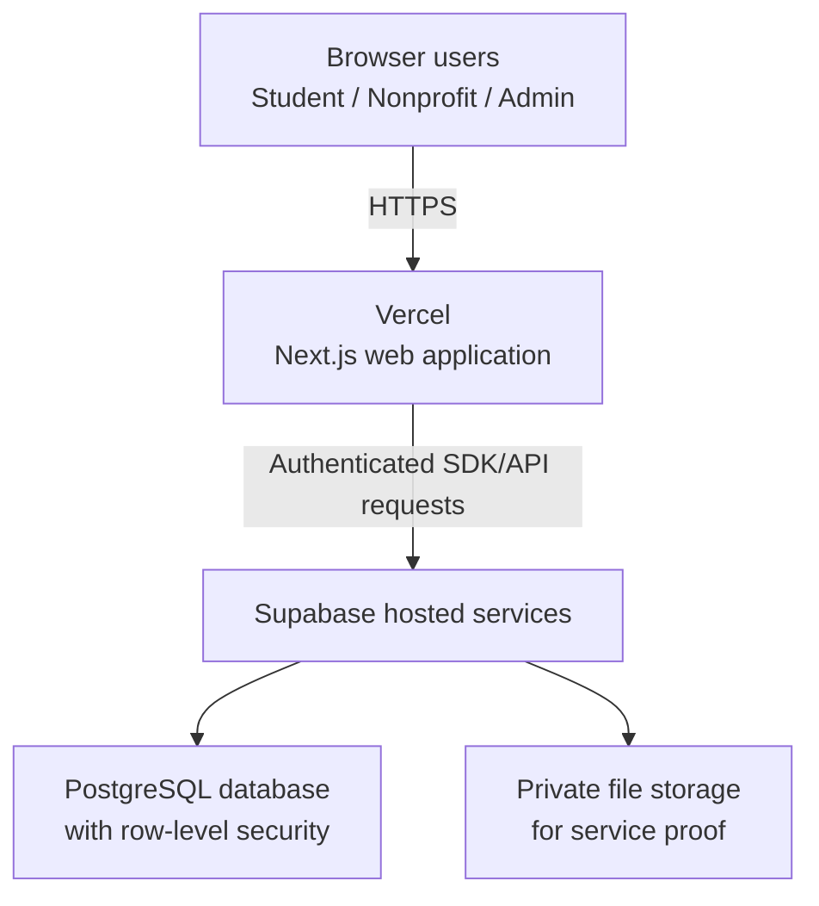

# VoluForge System Architecture

This document describes the planned architecture for the VoluForge minimum viable product (MVP). It reflects the current repository, the scope in [mvp.md](mvp.md), and the behavior in [features.md](features.md). Planned components are not necessarily complete yet.

## 1. Platform

VoluForge is a **responsive web application** for high-school students, nonprofit staff, and platform administrators. Users access the same hosted application through a modern desktop or mobile browser. The interface changes according to the signed-in user's role.

The MVP does not require a native iOS or Android application. It also does not require Xcode, Android Studio, mobile-app-store registration, or a separate desktop client.

### Main system responsibilities

- Students discover opportunities, apply, record service, and export verified service records.
- Nonprofit staff create opportunities, review applicants, and verify completed service.
- Administrators approve nonprofit organizations and perform limited account and audit operations.
- The server enforces authentication, authorization, ownership, and valid workflow transitions.
- The database preserves application, service, verification, and audit history.

## 2. Architecture overview

The browser never receives a trusted administrative or verification capability merely because a control is hidden in the interface. Next.js server code and Supabase security policies must independently confirm the user's session, role, organization membership, and ownership of the requested record.

## 3. User interface

### Technology

The user interface uses:

- **Next.js 15 App Router** for routing, layouts, server rendering, server actions, and route handlers
- **React 19** for interactive components and client-side state
- **TypeScript** for typed application code and shared data models
- **Tailwind CSS** for responsive styling
- **Lucide React** for interface icons

### Role-based interfaces

| Interface | Primary user | MVP capabilities |
| --- | --- | --- |
| Student interface | High-school volunteers | Manage profile, discover opportunities, apply, view statuses, submit service, and export verified records |
| Nonprofit portal | Authorized nonprofit staff | Manage organization profile, publish opportunities, review applicants, and verify service |
| Administrator interface | Authorized VoluForge operator | Approve/reject organizations, suspend/restore accounts, and inspect audit events |
| Public interface | Signed-out visitors | View product information and create or access an account |

All four interfaces are sections of one responsive web application rather than separate apps. Desktop layouts may use a sidebar while small-screen layouts use compact navigation, but both invoke the same protected application logic.

### Interface responsibilities

The browser may perform immediate usability checks, such as showing required fields or invalid durations. These checks improve feedback but are not trusted security controls. Every important rule must be repeated on the server and, where practical, in database constraints or row-level security policies.

## 4. Application logic

VoluForge uses the server capabilities built into **Next.js** rather than a separate Python, Java, or Express service for the MVP. The application logic is written in TypeScript and hosted with the web application on **Vercel**.

### Server-side responsibilities

- Read and validate the Supabase authentication session
- Direct users to the correct role-based interface
- Validate submitted form data
- Enforce organization ownership and role permissions
- Manage state transitions such as draft to published, submitted to accepted, and pending service to approved
- Prevent duplicate applications and conflicting service decisions
- Calculate approved service totals from stored records
- Generate a printable or downloadable verification record
- Record sensitive actions in the audit trail
- Return safe errors without exposing private records or implementation details

### Logical application layers

| Layer | Responsibility | Expected repository location |
| --- | --- | --- |
| Presentation | Pages, layouts, forms, tables, navigation, and status feedback | `app/`, `components/` |
| Application services | Workflow rules, validation, authorization helpers, and record generation | `app/` route handlers or server actions, `lib/` |
| Data access | Typed Supabase queries and persistence helpers | `lib/` |
| Shared contracts | TypeScript types and allowed status values | `types/` |
| Database definition | Tables, constraints, policies, migrations, and seed scripts | `database/` |

The architecture should keep workflow logic out of purely visual components so that authorization and state transitions can be tested without depending on the browser interface.

## 5. Data storage

### Primary database

VoluForge uses **Supabase PostgreSQL** as its relational database. PostgreSQL fits the MVP because the main records have clear relationships and consistency requirements: users belong to roles and organizations; applications belong to students and opportunities; service entries belong to accepted applications; and verification decisions must remain auditable.

### Planned core entities

| Entity | Purpose |
| --- | --- |
| `profiles` | Application profile connected to an authenticated user and role |
| `organizations` | Nonprofit identity, contact information, and verification status |
| `organization_staff` | Authorized relationship between users and organizations |
| `organization_verification_decisions` | Administrator decisions and reasons |
| `opportunities` | Structured volunteer listings and publication status |
| `applications` | Student applications and current decision state |
| `application_decisions` | Durable acceptance or rejection history |
| `service_entries` | Submitted service dates, durations, notes, and proof references |
| `service_reviews` | Approval, rejection, or needs-changes decisions |
| `audit_events` | Actor, target, action, reason, and timestamp for sensitive events |

### Data protection and integrity

- PostgreSQL foreign keys connect related records and prevent orphaned data.
- Check constraints restrict status and duration values.
- Unique constraints prevent duplicate active applications where appropriate.
- Supabase Row Level Security (RLS) limits which rows each role can read or change.
- Important timestamps are generated or validated on the server.
- Approved hours are calculated from approved service entries rather than stored browser totals.
- Historical applications, approvals, and audit records are archived instead of destructively deleted.

### File storage

If proof-file upload remains within the semester schedule, VoluForge will use a **private Supabase Storage bucket**. The database stores file metadata and an object reference; the binary file is stored separately. Access policies and short-lived signed URLs prevent evidence from becoming publicly enumerable.

The schedule-safe fallback is to support proof descriptions or metadata in the MVP demonstration while treating direct uploads as a stretch feature. A missing upload feature must not weaken service-entry authorization or approval rules.

## 6. External and hosted services

| Service | MVP status | Connection and purpose |
| --- | --- | --- |
| **Supabase Auth** | Required | Registers users, verifies email addresses, creates sessions, and supports password recovery |
| **Supabase PostgreSQL** | Required | Stores profiles, organizations, opportunities, applications, service entries, decisions, and audit history |
| **Supabase Storage** | Conditional | Privately stores service-proof files if upload work fits the MVP schedule |
| **Vercel** | Required for live demo | Builds and hosts the Next.js application and supplies preview/production deployments |
| **GitHub** | Required for development | Stores source code and documentation; Issues track project work and progress |
| **voluforge.xyz / DNS provider** | Required only for branded URL | Routes the custom domain to the stable Vercel production deployment |
| **Transactional email through Supabase Auth** | Required for account flows | Delivers verification and password-recovery messages; no marketing email is required |
| **Anthropic or OpenAI API** | Not required | Existing project-kit experiments may use AI, but the MVP service-verification loop must function without an AI provider |

### Integrations intentionally excluded from the MVP

VoluForge does not depend on Schoology, Google Classroom, school information systems, payment services, mapping services, calendar synchronization, background-check providers, electronic-signature services, or native mobile push notifications. Adding any of these during the semester would expand the security and testing surface without being necessary to prove the core workflow.

## 7. Request and data flow

A typical verified-service flow works as follows:

1. The browser sends an HTTPS request to the Next.js application.
2. Server-side code reads the user's Supabase session.
3. The server validates the submitted data, required role, organization relationship, and current record state.
4. Supabase RLS independently checks whether the user may access the affected database rows.
5. PostgreSQL writes the application, service entry, or decision in a controlled transaction.
6. Sensitive decisions also create an audit event.
7. The server returns only the data permitted for that user.
8. When a student requests a verified record, the server requeries approved entries and calculates the total instead of trusting a value supplied by the browser.

## 8. Hosting and environments

| Environment | Purpose | Data expectations |
| --- | --- | --- |
| Local development | Implement and test individual features | Local environment variables and clearly labeled test data |
| Vercel preview | Validate changes before production | Separate or controlled test data; never treated as official service |
| Production | Classroom demonstration and controlled pilot | Stable schema, protected secrets, seeded demo users, and known rollback version |

Secrets such as service credentials are stored in local or Vercel environment variables and are never committed to Git. The public Supabase anonymous key may be exposed to the client as designed, but it must be protected by correctly configured RLS policies. Any server-level privileged key must remain server-only.

## 9. Reliability and verification

The system architecture is considered ready for the MVP when:

- A clean environment can install dependencies and build the application.
- Versioned migrations create the required schema and security policies.
- Seeded student, nonprofit, and administrator users reach only their permitted interfaces.
- Direct requests from the wrong role or organization are rejected.
- A nonprofit can be approved and publish an opportunity.
- A student can apply, be accepted, and submit service.
- The owning nonprofit can verify the service exactly once.
- Only approved entries affect the student's total and exported record.
- The same end-to-end flow succeeds in the deployed environment.
- A tagged, known-good deployment or local build is available as a demo fallback.

## 10. Future architecture considerations

After the MVP is stable, the system could add a school-staff portal, richer proof storage, notification queues, monitoring, automated testing, and integrations with school platforms. Native mobile apps could reuse the same protected backend services. These extensions are deliberately deferred until the web MVP proves the core student-to-nonprofit verification loop.
